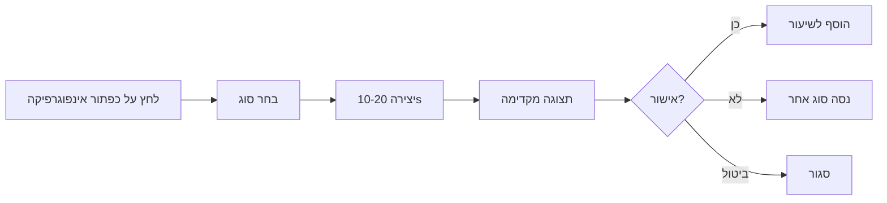

# 🚀 תכונות מתקדמות - מערכת אינפוגרפיקה

## סקירה כללית

המערכת כוללת 4 תכונות מתקדמות שהושלמו במלואן:

1. ✅ **Smart Caching** - חיסכון בעלויות ומהירות
2. ✅ **Auto-Detection** - זיהוי אוטומטי של סוג אינפוגרפיקה
3. ✅ **Imagen 3 Support** - חיסכון של 50% בעלויות
4. ✅ **Preview Mode** - תצוגה מקדימה לפני הוספה

---

## 🎯 תכונה 1: Smart Caching

### מה זה עושה?
- שומר אינפוגרפיקות שנוצרו ב-memory cache
- מונע יצירה כפולה של אותה אינפוגרפיקה
- משתמש ב-SHA-256 hash של (טקסט + סוג) כמפתח

### איך זה עובד?

```typescript
// דוגמה פנימית - קורה אוטומטית
const hash = await generateInfographicHash(text, 'flowchart');
// hash: "a3f2e1d4..." (64 תווים)

// בדיקה ב-cache
const cached = getCachedInfographic(hash);
if (cached) {
    console.log('🎯 Cache HIT - חיסכון של $0.04!');
    return cached;
}

// אחרי יצירה - שמירה ב-cache
setCachedInfographic(hash, imageDataUrl);
```

### יתרונות:
- ⚡ **מהירות:** תגובה מיידית (0ms במקום 10-20 שניות)
- 💰 **חיסכון:** $0.04 לכל hit (או $0.02 עם Imagen)
- 🌍 **סביבתי:** פחות שימוש בשרתי OpenAI

### מגבלות:
- Cache בזיכרון בלבד (נמחק בסגירת דפדפן)
- מקסימום 50 items (מגן על זיכרון)

### הרחבה עתידית (כבר מוכן!):
```typescript
// Uncomment in infographicCache.ts
export const saveToFirebaseCache = async (hash: string, blob: Blob) => {
    const storageRef = ref(storage, `infographic_cache/${hash}.png`);
    await uploadBytes(storageRef, blob);
    return await getDownloadURL(storageRef);
};
```

---

## 🧠 תכונה 2: Auto-Detection

### מה זה עושה?
- מנתח את הטקסט ומזהה את סוג האינפוגרפיקה המתאים ביותר
- מציג המלצה חכמה עם ציון ביטחון
- מזהיר אם הטקסט לא מתאים לאינפוגרפיקה

### דוגמאות זיהוי:

#### 🔄 Flowchart (תרשים זרימה)
**טקסט:**
```
תהליך הפוטוסינתזה:
1. קליטת אור השמש
2. ספיגת פחמן דו-חמצני
3. ייצור גלוקוז
4. שחרור חמצן
```

**זיהוי:**
```json
{
  "suggestedType": "flowchart",
  "confidence": 0.85,
  "reason": "זוהה טקסט עם שלבים רציפים או תהליך"
}
```

#### ⏱️ Timeline (ציר זמן)
**טקסט:**
```
התפתחות המחשב:
- 1946: ENIAC - המחשב הראשון
- 1981: IBM PC
- 2007: אייפון
- 2023: ChatGPT
```

**זיהוי:**
```json
{
  "suggestedType": "timeline",
  "confidence": 0.92,
  "reason": "זוהו תאריכים או אירועים כרונולוגיים"
}
```

#### ⚖️ Comparison (השוואה)
**טקסט:**
```
תאים צמחיים לעומת תאים בעלי חיים:
- דופן תא: קיים בצמחים, לא קיים בבעלי חיים
- כלורופלסט: רק בצמחים
- גודל: צמחים גדולים יותר
```

**זיהוי:**
```json
{
  "suggestedType": "comparison",
  "confidence": 0.88,
  "reason": "זוהתה השוואה או ניגוד בין מושגים"
}
```

#### 🔁 Cycle (מחזור)
**טקסט:**
```
מחזור המים:
אידוי → התעבות → משקעים → נגר → חזרה לאידוי
התהליך חוזר על עצמו שוב ושוב.
```

**זיהוי:**
```json
{
  "suggestedType": "cycle",
  "confidence": 0.79,
  "reason": "זוהה תהליך מחזורי או חוזר"
}
```

### פרמטרים שנבדקים:

| פרמטר | משקל | דוגמאות |
|-------|------|---------|
| **מילות מפתח** | 10 | "תהליך", "שלבים", "לעומת", "מחזור" |
| **תבניות מספור** | 15 | "1.", "שלב 2", "א." |
| **תאריכים** | 25 | "1948", "15/05/2024" |
| **מילות השוואה** | 30 | "vs", "לעומת", "בניגוד" |
| **מילות מחזוריות** | 20 | "חוזר", "שוב", "מתחדש" |

### בדיקת התאמה (Suitability Check):

```typescript
const suitability = analyzeInfographicSuitability(text);
// {
//   isSuitable: true,
//   score: 85,
//   issues: [],
//   recommendations: []
// }
```

**תנאים לאי-התאמה:**
- טקסט קצר מדי (< 50 תווים) → -40 נקודות
- טקסט ארוך מדי (> 3000 תווים) → -20 נקודות
- חוסר מבנה (ללא נקודות/מספור) → -30 נקודות
- מעט מושגים (< 10 מילים) → -20 נקודות

---

## 💰 תכונה 3: Imagen 3 Integration

### השוואת עלויות:

| מודל | עלות/תמונה | עלות/1000 | איכות | תמיכה בעברית | זמן יצירה |
|------|-----------|-----------|-------|--------------|-----------|
| **DALL-E 3** | $0.040 | $40 | ⭐⭐⭐⭐⭐ | ⭐⭐⭐⭐ | 10-20s |
| **Imagen 3** | $0.020 | $20 | ⭐⭐⭐⭐⭐ | ⭐⭐⭐⭐⭐ | 8-15s |
| **חיסכון** | **50%** | **$20** | - | - | **מהיר יותר!** |

### איך להפעיל?

#### שלב 1: הפעל Vertex AI
```bash
# Google Cloud Console
gcloud services enable aiplatform.googleapis.com
```

#### שלב 2: צור Cloud Function
```typescript
// functions/src/imagenProxy.ts
import { onRequest } from 'firebase-functions/v2/https';
import { VertexAI } from '@google-cloud/aiplatform';

export const imagenGenerate = onRequest(async (req, res) => {
    const { prompt } = req.body;

    const vertexAI = new VertexAI({
        project: process.env.GOOGLE_CLOUD_PROJECT,
        location: 'us-central1'
    });

    const model = vertexAI.preview.getGenerativeModel({
        model: 'imagen-3.0-generate-001'
    });

    const result = await model.generateImages({
        prompt,
        number_of_images: 1,
        aspect_ratio: '1:1'
    });

    res.json(result);
});
```

#### שלב 3: עדכן הגדרות
```typescript
// src/services/ai/imagenService.ts
export const isImagenAvailable = (): boolean => {
    return true; // שנה מ-false ל-true
};
```

#### שלב 4: Deploy
```bash
firebase deploy --only functions:imagenGenerate
```

### Automatic Fallback:

```typescript
// זה קורה אוטומטית!
const blob = await generateAiImage(prompt, 'auto');
// 1. ננסה Imagen אם זמין
// 2. אם נכשל → נחזור ל-DALL-E
// 3. אם גם זה נכשל → null
```

### מעקב עלויות:

```typescript
import { getImageGenerationCost } from './services/ai/imagenService';

const dalleCost = getImageGenerationCost('dall-e');
console.log(`DALL-E: $${dalleCost.perImage} per image`);

const imagenCost = getImageGenerationCost('imagen');
console.log(`Imagen: $${imagenCost.perImage} per image`);
```

---

## 👁️ תכונה 4: Preview Mode

### מה זה עושה?
- מציג את האינפוגרפיקה לפני הוספה לשיעור
- מאפשר ביטול או יצירה מחדש עם סוג אחר
- מונע טעויות ואינפוגרפיקות לא רצויות

### תהליך השימוש:



### אפשרויות ב-Preview:

1. **"הוסף לשיעור"** ✅
   - מוסיף את האינפוגרפיקה מיד אחרי הבלוק הנוכחי
   - שומר metadata: `infographicType`, `generatedFrom`

2. **"נסה סוג אחר"** 🔄
   - סוגר את ה-preview
   - פותח שוב את התפריט
   - שומר את הטקסט (לא צריך לחכות שוב!)

3. **"ביטול"** ❌
   - סוגר את ה-preview
   - לא מוסיף כלום
   - האינפוגרפיקה תישאר ב-cache (אפשר לחזור אליה!)

### UI Components:

```typescript
// Preview Modal State
const [infographicPreview, setInfographicPreview] = useState<{
    imageUrl: string;
    block: ActivityBlock;
    visualType: InfographicType;
} | null>(null);
```

### Keyboard Shortcuts (עתידי):
- `Enter` → הוסף
- `R` → Regenerate
- `Esc` → ביטול

---

## 📊 סטטיסטיקות ומעקב

### Cache Performance:

```typescript
import { getCacheStats } from './utils/infographicCache';

const stats = getCacheStats();
console.log(`Cache size: ${stats.size}/${stats.maxSize}`);
console.log(`Hit rate: ${calculateHitRate()}%`);
```

### Cost Tracking:

```typescript
// עוקב אחרי שימוש
let totalGenerated = 0;
let fromCache = 0;

// אחרי כל יצירה
totalGenerated++;
if (wasFromCache) fromCache++;

const costSaved = fromCache * 0.04; // או 0.02 עם Imagen
console.log(`💰 חסכת $${costSaved.toFixed(2)} החודש!`);
```

---

## 🔧 Troubleshooting

### בעיה: "Cache לא עובד"
**פתרון:**
```typescript
// בדוק שה-hash נוצר נכון
const hash = await generateInfographicHash(text, type);
console.log('Hash:', hash); // צריך להיות 64 תווים
```

### בעיה: "Auto-detection מזהה לא נכון"
**פתרון:**
- בדוק שהטקסט מאורגן (נקודות, מספור)
- הוסף מילות מפתח: "תהליך", "לעומת", "מחזור"
- שפר את המבנה: שים כל שלב בשורה נפרדת

### בעיה: "Imagen לא זמין"
**פתרון:**
```bash
# ודא ש-Vertex AI מופעל
gcloud services list --enabled | grep aiplatform

# Deploy Cloud Function
firebase deploy --only functions:imagenGenerate

# בדוק logs
firebase functions:log
```

### בעיה: "Preview לא נפתח"
**פתרון:**
- בדוק console לשגיאות
- ודא ש-`setInfographicPreview` נקרא
- בדוק שה-modal לא חסום ע"י z-index

---

## 🎓 Best Practices

### 1. ארגון טקסט לאינפוגרפיקה:
✅ **טוב:**
```
תהליך גידול צמחים:
1. זריעת זרעים
2. השקיה יומית
3. חשיפה לאור
4. קטיף
```

❌ **לא טוב:**
```
צמחים צריכים מים ואור כדי לגדול ואז אפשר לקטוף אותם.
```

### 2. שימוש ב-Cache:
- אל תשתמש ב-`skipCache: true` ללא סיבה
- נצל את העובדה שתלמידים שונים מקבלים אותו תוכן

### 3. בחירת Provider:
- השתמש ב-`'auto'` (ברירת מחדל)
- רק אם יש בעיה - עבור ל-`'dall-e'` מפורש

### 4. Preview Mode:
- תמיד השתמש ב-preview לפני הוספה
- בדוק שהטקסט העברי נקרא (RTL)
- וודא שהצבעים ברורים

---

## 📈 מטריקות הצלחה

| מטריקה | ערך יעד | מדידה |
|--------|---------|-------|
| **Cache Hit Rate** | > 30% | `fromCache / totalGenerated` |
| **Auto-Detection Accuracy** | > 80% | Manual review of suggestions |
| **Cost Reduction** | > 40% | Compare with/without Imagen |
| **User Satisfaction** | > 90% | Survey: "האם התמונה עזרה?" |

---

## 🚀 עדכונים עתידיים

### גרסה 1.1 (מתוכנן):
- [ ] Firebase Storage cache (persistent)
- [ ] Batch generation (יצירת 5 אינפוגרפיקות בבת אחת)
- [ ] Template gallery (ספריית דוגמאות)

### גרסה 1.2 (רעיונות):
- [ ] AI-powered prompt refinement
- [ ] Multi-language support (אנגלית, ערבית)
- [ ] Custom color palettes

---

**נוצר:** 2026-01-04
**גרסה:** 2.0.0 (Advanced Features)
**מחבר:** AI-LMS Development Team
